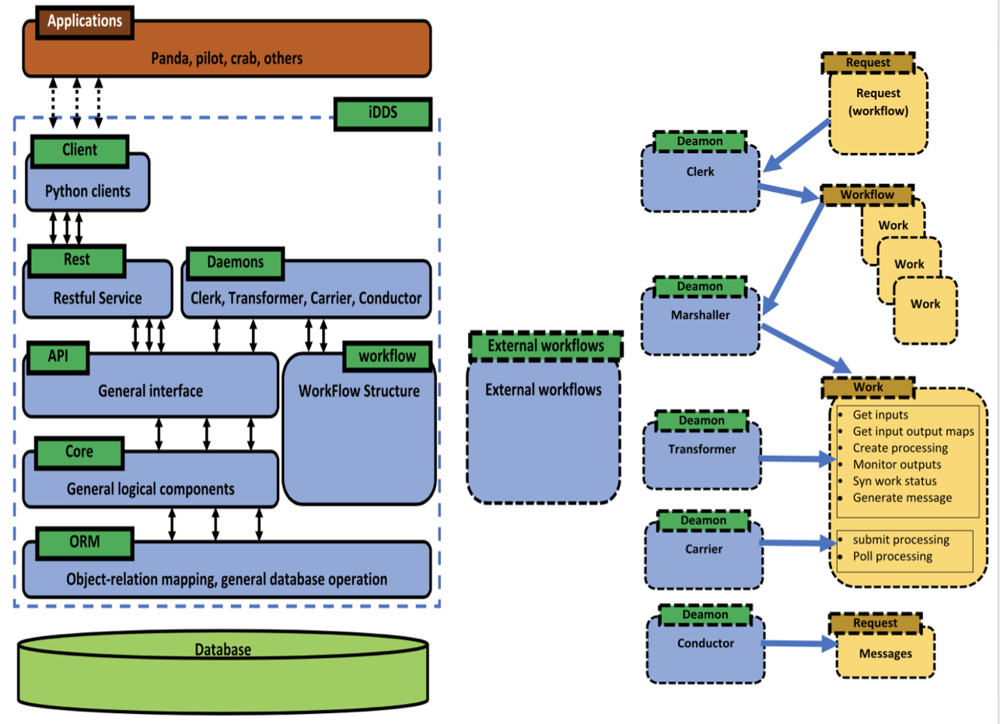

Architecture
==============

The iDDS is implemented in a distributed architecture. It composed of Daemons Agents,
RESTful serivces, User Interface and External Plugins.

Layers
~~~~~~

The iDDS is designed with abstract layers to hide the complexity of different logics
and every layer concentrates on one type of operations. It simplifies the logic of 
every layer and smooths the development and maintenance. The iDDS layers are composed of:

* ORM (Oject-Relational Mapping)
* Core layer
* API
* Restful services

Workflow
~~~~~~~~

The iDDS workflow architecture is another experiment agnostic design to support new emerging
workflows. In iDDS, a workflow consists of multiple works, where a work is a transformation.
The iDDS processing is designed based on the workflow(work) structure. For a new emerging
use case, an inherited Work class can be developed with implemented hook functions.
Then the new use case can be imported to iDDS.

Daemons
~~~~~~~
The iDDS daemons are active agents that orchestrate the collaborative work of the
whole system. They are for example:

* Request Daemon (Clerk) - in charge of handling requests
* Workflow Daemon (Marshaller) -- in charge of handling workflows.
* Transform daemon (Transformer) - in charge of handling transforms
* Processing daemon (Carrier) - in charge of handling processings which do the real data transformation.
* Message daemon (Conductor) - in charge of delivering messages to ActiveMQ, which will be consumed by following workflow.

Client
~~~~~~

The client is the user interface for users to communicate the RESTful service.

* Request client
* Catalog client
* HPO(HyperParameterOptimization) client
