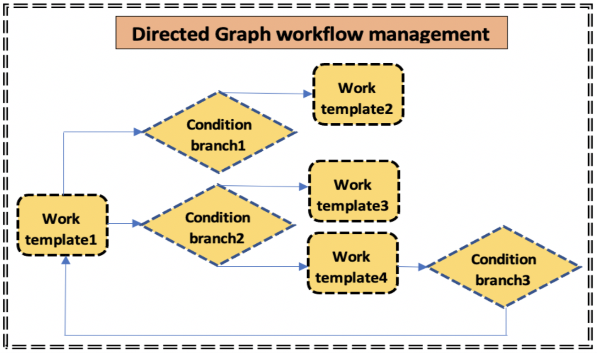

Directed Graph(DG) and Directed Acyclic Graph(DAG)
===================================================

The DG (Directed Graph) workflow management in iDDS not only supports DAG (Directed Acyclic Graph),
but also supports graphs with cycles. iDDS supports two different types of DAG.

Task Level DAG
~~~~~~~~~~~~~~~~

A Task level DAG is represented as a Workflow object which is composed of
multiple Work template objects and their relationship with condition branches, as shown below.
A Work template is a placeholder to generate new Work objects by assigning values for pre-defined parameters.
The condition will be evaluated when a work's status has changed, the following work will be triggerred based on the conditions.

1. When a work generates some new outputs, trigger to generate new jobs for the following work.
2. When a work is terminated, trigger to create new work or terminate the workflow based on condition evaluation.

Job Level DAG
~~~~~~~~~~~~~~~
.. image:: ../../images/v2/job_dag.png
            :alt: iDDS Job Directed Acyclic Graph(DAG)

For Job level DAG, it's different that at the beginning all jobs and their relations are defined.
Based on their relations, the jobs can be grouped to tasks to adapt workflow management system
(For example, PanDA job management is based on tasks).
iDDS Job DAG manages the dependencies and triggers to release jobs when all dependencies are ready.
