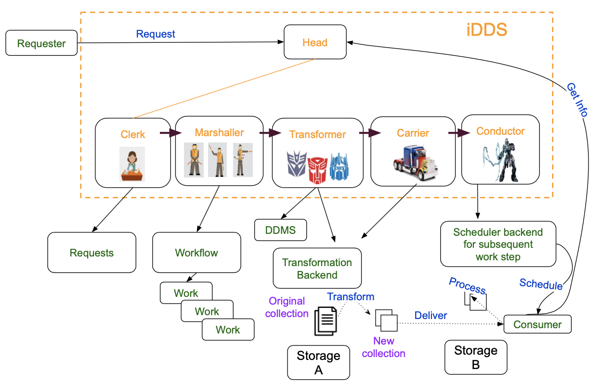

Schematic View
==============

The iDDS is designed as a standalone experiment agnostic service. It consists of
a general Restful service to receive requests from WFMS and several running agents
in a daemon mode to process the requests.

In this model, the Restful service is used to register and query requests. It also
provides a catalog service for users to retrieve required collections or contents.
In the daemon mode, an agent Clerk works to manage requests and covert requests to
workflow. The agent Marshaller works to manage workflow and split workflow to works,
where one work is one transformation. The workflow management includes DAG management.
The transformer works to query input replicas from DDMs, maps inputs to different
transform outputs and create processings to process the transformation. The Carrier
agent works to submit the processing and poll the processing.  When the output data
is available, the agent Conductor works in a fine-grained approach to notify
consumers to process the new transformed data.
