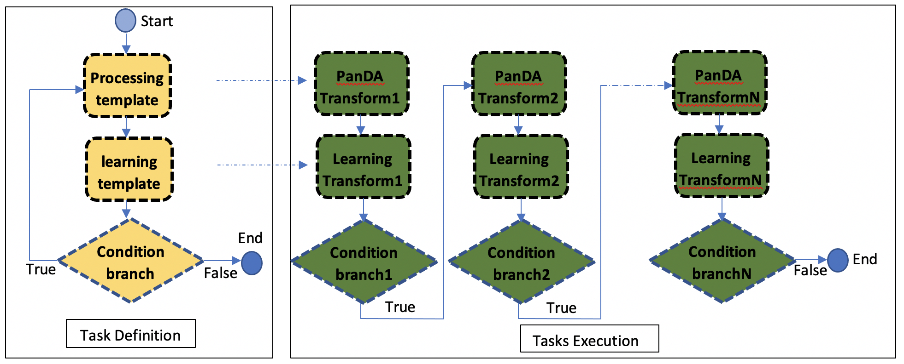

Active Learning(AL)
===================

Active Learning is an usecase of iDDS. The purpose of iDDS AL is to use iDDS to run some 'active learning' process to tell production system whether to continue some process.

iDDS AL  workflow
^^^^^^^^^^^^^^^^^

ActiveLearning employs iDDS DAG workflow management to define tasks.

1. It uses processing template and learning template to define the processing workflow.
2. It uses a Condition branch to control the workflow.
3. When executing, the processing template will generate a PanDA task.
4. When the PanDA task finishes, the learning template will generate a learning task which will run in iDDS internally condor cluster, to analyse the outputs of the PanDA task. The result of the learning task will decide whether to generate new PanDA tasks or to terminate.

processing task (ATLASPandaWork)
----------------------------------

1. upload inputs to Panda cache server and define the task parameter map.

.. code-block:: python

    import json
    import re
    import time
    # import traceback

    try:
        from urllib import quote
    except ImportError:
        from urllib.parse import quote

    from pandatools import Client

    from idds.client.clientmanager import ClientManager
    from idds.common.utils import get_rest_host, run_command

    from idds.workflow.workflow import Condition, Workflow
    from idds.atlas.workflow.atlaspandawork import ATLASPandaWork
    from idds.atlas.workflow.atlasactuatorwork import ATLASActuatorWork

    # Here a fake method is used.
    def get_task_id(output, error):
        m = re.search('jediTaskID=(\d+)', output + error)  # noqa W605
        task_id = int(m.group(1))
        return task_id

    def submit_processing_task():
        outDS = "user.wguan.altest%s" % str(int(time.time()))
        cmd = "cd /afs/cern.ch/user/w/wguan/workdisk/iDDS/main/lib/idds/tests/activelearning_test_codes; prun --exec 'python simplescript.py 0.5 0.5 200 output.json' --outDS %s  --outputs output.json --nJobs=10" % outDS
        status, output, error = run_command(cmd)
        """
        status:
        0
        output:

        error:
        INFO : gathering files under /afs/cern.ch/user/w/wguan/workdisk/iDDS/main/lib/idds/tests/activelearning_test_codes
        INFO : upload source files
        INFO : submit user.wguan.altest1234/
        INFO : succeeded. new jediTaskID=23752996
        """
        if status == 0:
            task_id = get_task_id(output, error)
            return task_id
        else:
            raise Exception(output + error)

    def get_panda_task_paramsmap(panda_task_id):
        status, task_param_map = Client.getTaskParamsMap(panda_task_id)
        if status == 0:
            task_param_map = json.loads(task_param_map)
            return task_param_map
        return None

    def define_panda_task_paramsmap():
        # here is using a fake method by submitting a panda task.
        # Users should define the task params map by themselves.

        # (0, '{"buildSpec": {"jobParameters": "-i ${IN} -o ${OUT} --sourceURL ${SURL} -r . ", "archiveName": "sources.0ca6a2fb-4ad0-42d0-979d-aa7c284f1ff7.tar.gz", "prodSourceLabel": "panda"}, "sourceURL": "https://aipanda048.cern.ch:25443", "cliParams": "prun --exec \\"python simplescript.py 0.5 0.5 200 output.json\\" --outDS user.wguan.altest1234 --outputs output.json --nJobs=10", "site": null, "vo": "atlas", "respectSplitRule": true, "osInfo": "Linux-3.10.0-1127.19.1.el7.x86_64-x86_64-with-centos-7.9.2009-Core", "log": {"type": "template", "param_type": "log", "container": "user.wguan.altest1234.log/", "value": "user.wguan.altest1234.log.$JEDITASKID.${SN}.log.tgz", "dataset": "user.wguan.altest1234.log/"}, "transUses": "", "excludedSite": [], "nMaxFilesPerJob": 200, "uniqueTaskName": true, "noInput": true, "taskName": "user.wguan.altest1234/", "transHome": null, "includedSite": null, "nEvents": 10, "nEventsPerJob": 1, "jobParameters": [{"type": "constant", "value": "-j \\"\\" --sourceURL ${SURL}"}, {"type": "constant", "value": "-r ."}, {"padding": false, "type": "constant", "value": "-p \\""}, {"padding": false, "type": "constant", "value": "python%20simplescript.py%200.5%200.5%20200%20output.json"}, {"type": "constant", "value": "\\""}, {"type": "constant", "value": "-l ${LIB}"}, {"container": "user.wguan.altest1234_output.json/", "value": "user.wguan.$JEDITASKID._${SN/P}.output.json", "dataset": "user.wguan.altest1234_output.json/", "param_type": "output", "hidden": true, "type": "template"}, {"type": "constant", "value": "-o \\"{\'output.json\': \'user.wguan.$JEDITASKID._${SN/P}.output.json\'}\\""}], "prodSourceLabel": "user", "processingType": "panda-client-1.4.47-jedi-run", "architecture": "@centos7", "userName": "Wen Guan", "taskType": "anal", "taskPriority": 1000, "countryGroup": "us"}')  # noqa E501

        task_id = submit_processing_task()
        task_param_map = get_panda_task_paramsmap(task_id)
        cmd_to_arguments = {'arguments': 'python simplescript.py 0.5 0.5 200',
                            'parameters': 'python simplescript.py {m1} {m2} {nevents}'}

        # update the cliParams to have undefined parameters, these parameters {m1}, {m2}, {nevents} will be the outputs of learning script.
        task_param_map['cliParams'] = task_param_map['cliParams'].replace(cmd_to_arguments['arguments'], cmd_to_arguments['parameters'])
        jobParameters = task_param_map['jobParameters']
        for p in jobParameters:
            if 'value' in p:
                p['value'] = p['value'].replace(quote(cmd_to_arguments['arguments']), quote(cmd_to_arguments['parameters']))
        return task_param_map

2. define the panda work.

.. code-block:: python
    
    task_param_map = define_panda_task_paramsmap()
    panda_work = ATLASPandaWork(panda_task_paramsmap=task_param_map)

    # it's needed to parse the panda task parameter information, for example output dataset name, for the next task.
    # if the information is not needed, you don't need to run it manually. iDDS will call it interally to parse the information.
    panda_work.initialize_work()

learning task (ATLASActuatorWork)
----------------------------------

1. define the learning task.
    (a) The input collection of the learning task is the output of the panda task. iDDS will download all files of this dataset to local storage and process them.
    (b) The sandbox is using the panda task's sandbox. You can also use iDDS cache server for it.

.. code-block:: python
    
    work_output_coll = panda_work.get_output_collections()[0]

    input_coll = {'scope': work_output_coll['scope'],
                  'name': work_output_coll['name'],
                  'coll_metadata': {'force_close': True}}  # by default the panda collection is not closed. If it's not closed, iDDS will poll again and again without stop.
    output_coll = {'scope': work_output_coll['scope'],
                   'name': work_output_coll['name'] + "." + str(int(time.time()))}

    # acutator = ATLASActuatorWork(executable='python', arguments='merge.py {output_json} {events} {dataset}/{filename}',
    acutator = ATLASActuatorWork(executable='python', arguments='merge.py {output_json} {events} {dataset}',
                                 parameters={'output_json': 'merge.json',
                                             'events': 200,
                                             'dataset': '{scope}:{name}'.format(**input_coll),
                                             'filename': 'output*.json'},
                                 sandbox=panda_work.sandbox, primary_input_collection=input_coll,
                                 output_collections=output_coll, output_json='merge.json')

Define workflow
----------------------------------

.. code-block:: python
    
    wf = Workflow()
    # because the two tasks are in a loop. It's good to set which one to start.
    wf.add_work(panda_work)
    wf.add_work(acutator)
    cond = Condition(panda_work.is_finished, current_work=panda_work, true_work=acutator, false_work=None)
    wf.add_condition(cond)
    cond1 = Condition(acutator.generate_new_task, current_work=acutator, true_work=panda_work, false_work=None)
    wf.add_condition(cond1)

    # because the two works are in a loop, they are not independent. This call is needed to tell which one to start.
    # otherwise idds will use the first one to start.
    wf.add_initial_works(work)

    # work.set_workflow(wf)
    return wf

The AL example
--------------

See examples in https://github.com/wguanicedew/iDDS/blob/dev/main/lib/idds/tests/test_activelearning.py
