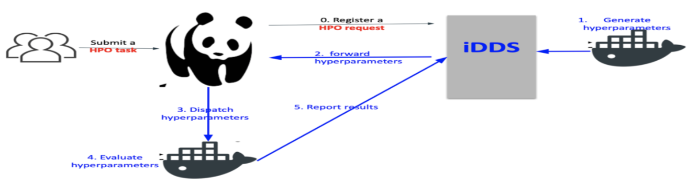

HyperParameterOptimization(HPO)
===============================

HPO is a use-case of iDDS. The purpose of iDDS HPO is to use iDDS to generate hyperparameters for machine learning and trigger production system to automatically process the machine learning training with provided hyperparameters.

iDDS HPO workflow
^^^^^^^^^^^^^^^^^

0. The user prepares two container images. One for optimization and sampling (Steering container), and the other for training (Evaluation container). He/she can use pre-defined methods if they meet his/her requirements.
1. The user submit a HPO task to JEDI.
2. JEDI submits a HPO request to iDDS.
3. iDDS generates multiple sets of hyperparameters (hyperparameter points) in the search space using the Steering container or pre-defined methods, and stores them in iDDS database. Each hyperparameter point has a serial number and corresponds to a single machine learning training job.
4. Serial numbers are sent to JEDI through ActiveMQ.
5. JEDI generates PanDA jobs and dispatches them to pilots running on compute resources.
6. Each PanDA job fetches a serial number from PanDA and converts it to the corresponding hyperparameter point by checking with iDDS.
7. Once the hyperparameter point is evaluated using the Evaluation container, the loss is registered to iDDS.
8. The PanDA job fetches another serial number and evaluates the corresponding hyperparameter point if wall-time is still available.
9. When the number of unprocessed hyperparameter points goes below a threshold, iDDS automatically generates new hyperparameter points. Steps 3-9 will be iterated until:

    a. The total number of hyperparameter points reaches max_points. This parameter can be defined in the request.
    b. The Steering container / pre-defined method fails or returns [].

10. When all hyperparameter points are evaluated, iDDS sends a message to JEDI to terminate the HPO task.

Optimization and Sampling
--------------------------

Currently iDDS support several different ways to generate hyperparameter points.

    See examples in "User Documents" -> "iDDS RESTful client: Examples"

RESTful Service
----------------

1. To retrieve hyperparameters.

    See examples in "User Documents" -> "iDDS RESTful client: Examples"
    clientmanager.get_hyperparameters(workload_id, request_id, id=None, status=None, limit=None)

    examples:
        clientmanager.get_hyperparameters(workload_id=123, request_id=None)
        clientmanager.get_hyperparameters(workload_id=None, request_id=456)
        clientmanager.get_hyperparameters(workload_id=None, request_id=456, id=0)

2. To register loss of a group of hyperparameters.

    clientmanager.update_hyperparameter(request_id, id, loss)

3. Example code: main/lib/idds/tests/hyperparameteropt_client_test.py

User-defined Steering Container
--------------------------------

Users can provide their own container images to generate hyperparameter points using
the ask-and-tell pattern. Note that users need to use HPO packages such as
`skopt <https://scikit-optimize.github.io/stable/>`_ and
`nevergrad <https://github.com/facebookresearch/nevergrad>`_ which support
the ask-and-tell pattern when making Steering containers.
Users can also provide execution strings to specify what are executed in containers.
Each execution string needs to contain the following placeholders to get some parameters
through command-line arguments.

%MAX_POINTS
  The max number of hyperparameter points to be evaluated in the entire search. iDDS stops generating new hyperparameter points when it receives an empty list []. The container needs to return [] if enough hyperparameter points are generated.

%NUM_POINTS
   The number of hyperparameter points to be generated in this iteration. The default is 10. It can be changed by setting 'num_points_per_generation' in the request_metadata. The Steering container runs (%MAX_POINTS / %NUM_POINTS) times in the entire search.

%IN
   The name of input file which iDDS places in the current directory every time it calls the container. The file contains a json-formatted list of all hyperparameter points, which have been generated so far, with corresponding loss (or None if it is not yet evaluated).

%OUT
   The name of output file which the container creates in the current directory. The file contains a json-formatted list of new hyperparameter points.

When iDDS runs Steering containers, iDDS will replace %XYZ with actual parameters.
For example, if an execution string is something like ``python opt.py --n=%NUM_POINT ...``,
``python opt.py --n=10 ...`` will be executed in the container.
Input and output are done through json files in the current directly ($PWD) so that
the directory needs to be mounted.

Here is one example for the input (main/lib/idds/tests/idds_input.json). It is a json dump of
``{"points": [[{hyperparameter_point_1}, loss_or_None], ..., [{hyperparameter_point_N}, loss_or_None]], "opt_space": <opt space>}``.
``{hyperparameter_point}`` is a dictionary representing a single hyperparameter point.
The keys of the dictionary can be arbitrary strings and correspond to the axes of the search space.
For example, if there is a two dimensional search space with two hyperparameters, 'epochs' and 'batch_size',
the dictionary could be something like ``{'epochs': blah_1, 'batch_size': blah_2}``.
``points`` includes all hyperparameter points, which have been generated so far, whether or not they have been evaluated.
If a hyperparameter point is not yet evaluated, the ``loss_or_None`` will be None.
``opt_space`` is a copy of the content from your request. If in your request ``opt_space`` is not defined,
``opt_space`` will be None.

The output is a json dump of ``[{new_hyperparameter_point_1}, , ..., [{new_hyperparameter_point_N}]``.
``{new_hyperparameter_point}`` is a dictionary representing a new hyperparameter point.
The format of the dictionary is the same as the one in the input.

Basically what the Steering container needs to do is as follows:

1. Define an optimizer with a search space.
2. Json-load ``%IN`` and update the optimizer with all hyperparameter points in ``%IN`` using the tell method.
3. Generate new hyperparameter points using the ask method, and json-dump them to ``%OUT``. The number of new hyperparameter points is ``min(%NUM_POINTS, %MAX_POINTS - NUM_POINTS_SO_FAR)`` where ``NUM_POINTS_SO_FAR`` stands for the total number of hyperparameter points generated so far.

How to test the Steering container
************************************
Here is one example (`Steering_local_test https://github.com/HSF/iDDS/blob/master/main/lib/idds/tests/hyperparameteropt_docker_local_test.py`_). Users can update the request part and test their docker locally.

User-defined Evaluation Container
-----------------------------------

Users can provide their own container images to evaluate hyperparameter points and can provide
execution strings to specify what are executed in their containers.
The pilot and user-defined Evaluation container communicate with each other using the following files
in the current directory ($PWD), so that the directory needs to be mounted.
Their filenames can be defined in HPO task parameters. There are two files for input
(one for a hyperparameter point to be evaluated and the other for training data) and
three files for output (the first one to report the loss, the second one to report job metadata,
and the last one to preserve training metrics). The input file for a hyperparameter point and
the output file to report the loss are mandatory, while other files are optional.

Input for Evaluation Container
*****************************************
The pilot places two json files before running the Evaluation container.
One file contains a json-formatted list of all filenames in the training dataset,
i.e., it is a json-dump of ``[training_data_filename_1, training_data_filename_2, ..., training_data_filename_N]``.
If training data files need to be directly read from the storage the file contains a json-formatted list of full paths
to training data files.
The other file contains a single hyperparameter point to be evaluated.
A hyperparameter point is represented as a dictionary and the format of the dictionary follows
what the Steering container generated.
For example, if the Steering container generates a hyperparameter point like
``{'epochs': blah_1, 'batch_size': blah_2}``, the file will be a json-dump of
``{'epochs': blah_1, 'batch_size': blah_2}``.

Output from Evaluation Container
***********************************************
The Evaluation container evaluates the hyperparameter point and produces one json file.
The file contains a json-formatted dictionary with the following key-values: ``status``: ``integer`` (0: OK, others: Not Good),
``loss``: ``float``, ``message``: ``string`` (optional). It is possible to produce another json file to report
job metadata to PanDA. It is a json-dump of an arbitrary dictionary, but the size must be less than 1MB.
It is also possible to produce a tarball to preserve training metrics. The tarball is uploaded to the storage
so that the size can be larger. The tarball can be used for post-processing such as visualization
of the search results after been downloaded locally.
